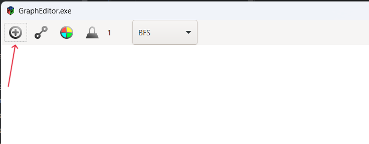
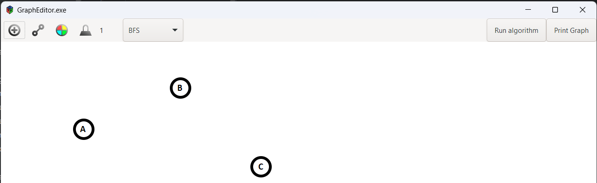

# GraphEditor

Project on C++

## **Описание проекта**

Этот проект представляет собой визуализацию различных алгоритмов на графах, таких как поиск в ширину (BFS), поиск в
глубину (DFS), алгоритм Дейкстры, алгоритм Беллмана-Форда, алгоритм Прима и алгоритм Крускала. Проект разработан на C++
с использованием библиотеки GTK для графического интерфейса пользователя.

## Структура проекта

main.cpp: основной файл с запуском приложения и определением графического интерфейса.

graph.hpp и graph.cpp: файлы с реализацией графа и алгоритмов.

canvas.hpp и canvas.cpp: файлы с реализацией рисования графа на экране.

Graph_tests.cpp: файл с тестами для алгоритмов.

..............

## Установка

### Зависимости

Для успешного выполнения проекта необходимы следующие зависимости:

1. C++ компилятор (например, g++)
2. GTK (установить через пакетный менеджер вашей операционной системы)
3. CMake (для сборки проекта)
4. Google Test (для тестирования)

## Сборка проекта

1. Клонируйте репозиторий:

git clone https://github.com/FreeCadelca/GraphEditor.git

2. Перейдите в директорию проекта:

cd GraphEditor

3. Создайте директорию для сборки и перейдите в нее:

mkdir build

cd build

4. Запустите CMake для генерации файлов сборки:

cmake ..

5. Соберите проект:

make

6. Запустите исполняемый файл:

./GraphEditor

7. Запустите тесты:

./GraphTests

## Визуализация алгоритмов

### В интерфейсе вы можете:

1. Добавлять вершины и рёбра, щёлкая на поле графа.
2. Выбирать стартовую и конечную вершины для выполнения алгоритмов.
3. Выбирать и запускать различные алгоритмы для визуализации их работы на графе.

## Алгоритмы

### Алгоритм Дейкстры

Находит кратчайшие пути от одной стартовой вершины до всех остальных вершин в графе с неотрицательными весами рёбер.

### Алгоритм Беллмана-Форда

Находит кратчайшие пути от одной стартовой вершины до всех остальных вершин в графе, включая графы с отрицательными
весами рёбер. Может обнаруживать отрицательные циклы.

### Алгоритм Прима

Находит минимальное остовное дерево графа, используя подход жадного алгоритма.

### Алгоритм Крускала

Находит минимальное остовное дерево графа, сортируя рёбра по весу и добавляя их в остовное дерево, избегая циклов.

### Поиск в ширину (BFS)

Обходит граф в ширину, начиная с указанной стартовой вершины.

### Поиск в глубину (DFS)

Обходит граф в глубину, начиная с указанной стартовой вершины.

## Тестирование

Для тестирования используется Google Test Framework. Тесты для различных алгоритмов расположены в файле Graph_tests.cpp.

## Руководство пользователя программы GraphEditor

### Создание графа

1. При запуске программы открывается окно редактора.

3. Для добавления вершин необходимо нажать на кнопку «Add vertex» (рис. 1).

    Рисунок 1.

3. При дальнейшем нажатии на пустое пространство холста будут добавляться вершины, названные латинскими буквами (рис.
   2).

   
   Рисунок 2.

4. Для добавления ребер необходимо нажать на кнопку «Add edge» (рис. 3). По умолчанию вес ребра – 1.

   
   Рисунок 3.

6. Для создания ребра между двумя вершинами необходимо провести мышь в зажатом положении из одной вершины к другой (рис. 4).

   
   Рисунок 4.

7. Если при добавлении ребра нужно изменить вес ребра, то необходимо нажать на кнопку «Change weight», рядом с кнопкой
   высвечивается текущий вес (рис. 5). После открытия диалогового окна написать новый вес, нажать кнопку «OK».
   Следующее добавленное ребро будет иметь новый вес.

   
   Рисунок 5.

6. Если в процессе работы с графом нужно изменить ее цвет, необходимо нажать на кнопку «Choose color for graph». После открытия диалогового окна выбрать цвет, нажать кнопку «Выбрать» (рис. 6). При добавлении нового элемента
   граф изменит свой цвет.

   
   Рисунок 6.

### Выполнение алгоритмов

1. Для выбора алгоритма необходимо нажать на кнопку «Choose algorithm» (рис. 7).

   
   Рисунок 7.

 
2. Для начала выполнения алгоритма необходимо нажать на кнопку «Run algorithm» (рис. 8). Для некоторых алгоритмов нужно
   указать в диалоговых окнах стартовую и (или) конечную вершину. В результате выполнения алгоритма пользователь видит
   анимацию выполнения обходов или подграф, выделенный цветом.

   
   Рисунок 8.

### Визуализация алгоритмов

1. Поиск в ширину (BFS) (gif. 1).

   GIF-файл 1

2. Поиск в глубину (DFS) (gif. 2).

   GIF-файл 2

3. Алгоритм Дейкстры (рис. 9).

   Рисунок 9.

4. Алгоритм Беллмана-Форда (рис. 10).

   
   Рисунок 10.

5. Алгоритм Прима (рис. 11).

   
   Рисунок 11.

6. Алгоритм Крускала (рис. 12).

   
   Рисунок 12.

# Авторы

## Дмитрий Кулешов

Основной вклад: окно приложения, сборка проекта, интеграция с библиотекой GTK и управление зависимостями.

Занимался разработкой основного интерфейса, обеспечивая удобство использования и функциональность приложения.

## София Бердус

Основной вклад: разработка и реализация алгоритмов, интеграция GoogleTest'ов в проект.

Занималась реализацией различных алгоритмов на графах, таких как поиск в ширину (BFS), поиск в глубину (DFS), алгоритм
Дейкстры, алгоритм Беллмана-Форда, алгоритм Прима и алгоритм Крускала.

## Акназар Муртазин

Основной вклад: анимация алгоритмов, рисование графа.

Разработал визуализацию и анимацию для различных алгоритмов, обеспечивая наглядное представление их работы.